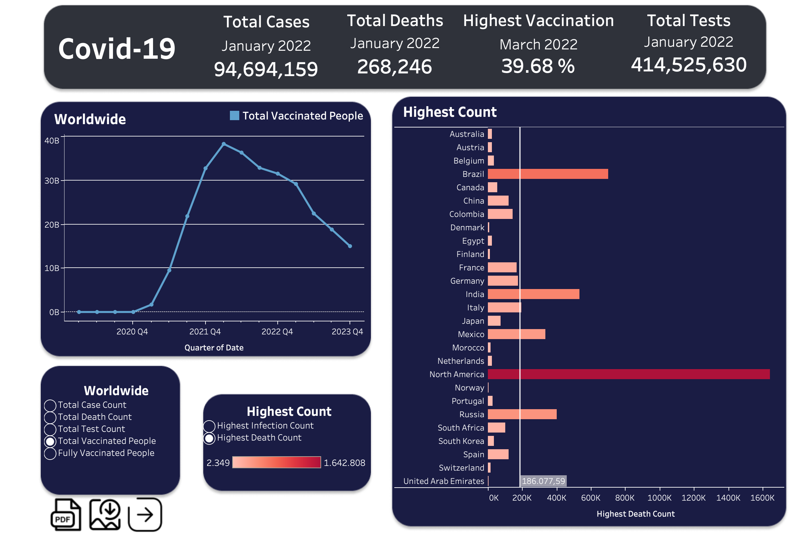
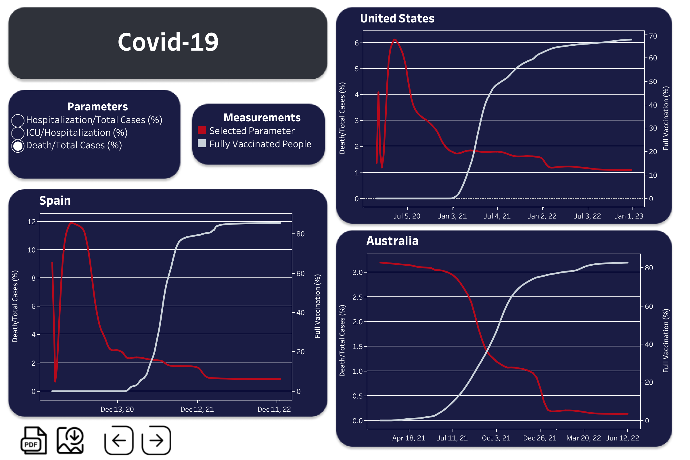
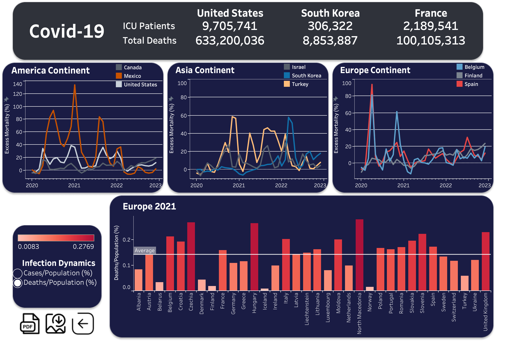

# Covid-19 Impact on World throughout Years

This project issues the Covid-19 pandemic. The original dataset collects data from 2020 to 2024. The dataset includes 67 columns such as case number, new death number, and stringency index. I processed data and calculated new parameters using PostgreSQL. Various novel tables are created in pgAdmin 4. 

Generated tables were transferred to Tableau Desktop. After building relations between tables, I created graphs presented as Dashboards (Tableau feature). I utilized parameters, calculated fields, and filters to produce interactive charts and dashboards. Figma is employed for background design. 

## Tools
PostgreSQL (pgAdmin 4) 

Excel

Tableau Desktop

Figma
## View Interactive Charts and Dashboards

https://public.tableau.com/app/profile/sevilay.munire.girgin/vizzes

For sneak peak of dashboards see Images section.
## Demonstrates

1A- Worldwide total case count peaks at 1st quarter of 2022.
1B- Worldwide total death count reaches its max in 1st quarter of 2021.
1C- The worldwide number of vaccinated people reaches 39 Billion (maximum).

2A- The highest infection count is 124.5 Million in North America.
2B- In China, the highest infection count is 99.3 Million.
2C- The highest death count is 1.6 Million in North America.
2D- In Brazil, the highest death count is 700K.
2E- In India, highest death count is 500K.

3A- The COVID-19 vaccine significantly lowered hospitalization of infected people.
3B- Vaccination noticeably decreased ICU admissions of hospitalized COVID-19 patients.
3C- Vaccines drastically lowered Covid-19 deaths.

4A- Mexico experienced drastic excess mortality due to COVID-19 on the American continent.
4B- In Asia, analyzed countries followed a similar trajectory, yet Turkey had higher excess mortality. 
4C- Finland experienced steady excess mortality in Europe compared to Belgium and Spain.
4D- Spain and Belgium display a forceful spike in excess mortality at the beginning of the pandemic. 

5A- In 2021, 15% of Czechia's population was infected by Covid-19. It is followed by Slovenia(12.5%) and United Kingdom(9%). 
5B- Czechia, North Macadenoi, Hungary, and the United Kingdom bear Europe's highest COVID-19 death/population in 2021.

## Background to Dataset

The actual death toll from COVID-19 is likely to be higher than the number of confirmed deaths – this is due to limited testing and problems in the attribution of death cause. The difference between reported confirmed deaths and actual deaths varies by country.
COVID-19 death record methodology may differ between countries (e.g., some countries only count hospital deaths, whereas others also include deaths in homes).
The death figures on a given date do not necessarily display the number of new deaths on that day but the deaths reported on that day. Since reporting can vary noticeably from day to day, it is helpful to view the long-term average of the count.

Like confirmed cases, the number of reported deaths on a given day does not necessarily reflect the actual number of COVID-19 deaths on that day or in the previous 24 hours. This is due to lags and delays in reporting.

Population size differences between countries are often significant, and the COVID-19 death count in more populous countries tends to be higher. Because of this, it is vital to analyze the number of confirmed deaths in a country compared to its population, especially when comparing countries.

Excess mortality is measured as the difference between the reported number of deaths in a given period in 2020–2024 and an estimate of the expected deaths for that period had the COVID-19 pandemic not occurred.

Excess Deaths = Reported Deaths - Expected Deaths

## Images

## Acknowledgements

 - Edouard Mathieu, Hannah Ritchie, Lucas Rodés-Guirao, Cameron Appel, Charlie Giattino, Joe Hasell, Bobbie Macdonald, Saloni Dattani, Diana Beltekian, Esteban Ortiz-Ospina and Max Roser (2020) - "Coronavirus Pandemic (COVID-19)". Published online at OurWorldInData.org. Retrieved from: 'https://ourworldindata.org/coronavirus' [Online Resource]

 - @article{owidcoronavirus,
    author = {Edouard Mathieu and Hannah Ritchie and Lucas Rodés-Guirao and Cameron Appel and Charlie Giattino and Joe Hasell and Bobbie Macdonald and Saloni Dattani and Diana Beltekian and Esteban Ortiz-Ospina and Max Roser},
    title = {Coronavirus Pandemic (COVID-19)},
    journal = {Our World in Data},
    year = {2020},
    note = {https://ourworldindata.org/coronavirus }}

- readme.so